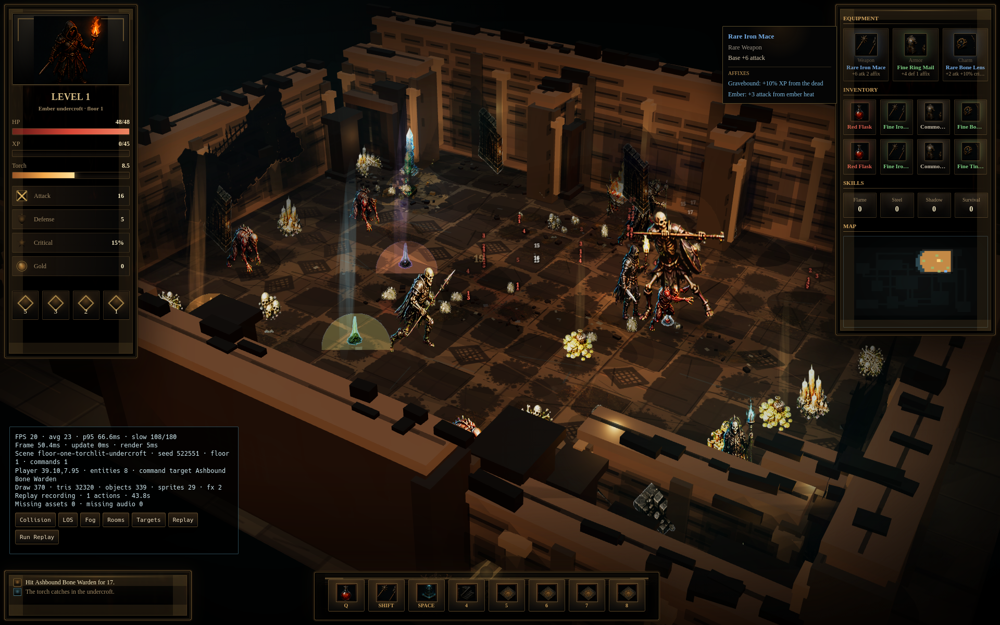
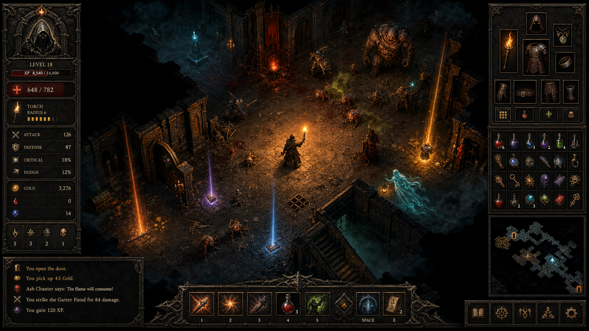

# Dungeon Torch Crawler



Dungeon Torch Crawler is a fixed-camera torchlit action RPG (ARPG) vertical slice built with Bun, Vite, TypeScript, and Three.js.

**Naming**

Dungeon Torch Crawler is the open source project name. Torchline was the name for the 2D flat rougelike game. Torchlit is ARPG upgraded from Torchline. Torchlit is a pre-rendered 3D (2.5D isometric) survival game genre like Halls of Torment or Diablo.

The project focuses on one polished proof: a dense gothic dungeon chamber with click-to-move controls, real-time combat, torch-shaped visibility, loot, shrines, save/load, replay/debug support, local audio, and a measurable browser performance target.



## Status

Vertical slice.

The runtime already includes a Three.js renderer, authored floor-one scene data, actor sprites, local audio, item affixes, elite monsters, shrines, local persistence, replay/debug state, and automated tests.

## Updates

You can follow me on X/Twitter for updates: [@cedric_chee](https://x.com/cedric_chee)

- 2026-06-26:
  - GLM-5.2 model evaluation (demo video): https://x.com/cedric_chee/status/2070223250035224908

## Quick Start

```sh
bun install
bun run dev
```

Open the Vite URL printed by the dev server.

Common checks:

```sh
bun run typecheck
bun run test
bun run build
bun run lint
```

Asset checks:

```sh
bun run generate:assets
bun run validate:assets
```

## Controls

- Click floor: move.
- Click monster: target and attack.
- `Space`: active ability.
- `Shift`: basic attack.
- `Q`: drink potion.
- `E`: use stairs.
- `F`: activate shrine.
- `P` or `Escape`: pause/resume.
- `R`: restart.
- `1`, `2`, `3`: choose a skill when prompted.
- `` ` `` or `~`: debug overlay.
- `WASD` or arrow keys: secondary movement/testing input.

## Documentation

Start here:

- [Documentation Home](docs/README.md)
- [Product Background and Decisions](docs/product-background.md)
- [Developer Guide](docs/developer-guide.md)
- [Architecture](docs/architecture.md)
- [Gameplay Systems](docs/gameplay-systems.md)
- [Asset Pipeline](docs/assets.md)
- [Testing](docs/testing.md)
- [Contributing](CONTRIBUTING.md)

## Project Map

```text
src/
  assets/      atlas manifest, loader, manifest validation
  audio/       Web Audio mixer and cue manifest
  core/        game state, combat, items, persistence, replay, RNG
  input/       keyboard and command dispatch
  render/      Three.js renderer, effects, actor sprites
  scene/       authored floor-one scene and navigation helpers
  tests/       Vitest coverage for core and render helpers
  ui/          DOM HUD controller
assets/
  atlas/       runtime texture atlases
  audio/       runtime audio files
  source/      source art sheets and generated inputs
qa/            visual QA screenshots and animation captures
docs/          documentation
```

## Product Direction

The north star is not a broad procedural dungeon yet. It is one impressive, playable, measurable chamber. The first slice should prove:

- Fixed-camera depth instead of a flat tile board.
- Contiguous stone architecture.
- Real-time click-to-move combat.
- Opaque grounded actors with readable animation.
- Torchlight, fog, and local mood.
- Loot and shrine feedback that feels rewarding.
- Stable 30 FPS minimum in local Chrome.

Future expansion should grow from this slice only after the core feel, rendering, and performance gates hold.

## License

Dungeon Torch Crawler is released under the MIT License. See [LICENSE](./LICENSE).
