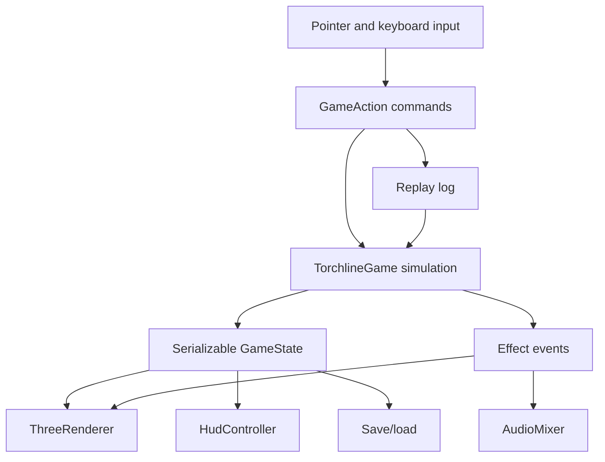

# Architecture

## Goals

The engine is built around one rule: gameplay state stays clean and serializable, while rendering, audio, DOM, storage, and browser events stay at the edges.

This keeps the slice easier to test, save, replay, and later port or extend.

## System Diagram

## Main Boundaries

### Core

Core files under `src/core/` own the rules:

- Player stats, movement, combat, death, progression.
- Items, rarity, affixes, gear comparison, pickup.
- Monsters, elites, shrines, buffs.
- Dungeon state, fog, doors, stairs.
- Save/load and replay data.

Core state should stay JSON-compatible except for typed arrays inside dungeon data, which are converted during save/load.

### Scene

`src/scene/floor-one.ts` is authored scene data. It defines the first chamber: camera constants, walkable bounds, blockers, decals, fog bands, pillars, wall runs, doorways, props, torches, monsters, loot, and shrine hints.

`src/scene/navigation.ts` adapts this authored scene to pathing, collision, click interaction, and door runtime state.

### Renderer

`src/render/three-renderer.ts` owns Three.js objects, materials, textures, sprites, hit testing, dynamic effects, and render metrics.

The renderer reads game state. It should not own combat rules or mutate simulation state directly.

### Assets

`src/assets/manifest.ts` defines local atlas images, frame rectangles, pivots, tags, and actor animations. `src/assets/validate-manifest.ts` checks path existence and atlas bounds.

Runtime assets are local files under `assets/`.

### Audio

`src/audio/mixer.ts` uses Web Audio. Audio unlocks after user interaction, preloads local cues, runs ambience loops, and plays one-shot SFX from effect events.

Rendering code should not trigger gameplay audio directly.

### UI

`src/ui/hud.ts` owns DOM presentation. The main loop dirty-renders the HUD only when state changes or debug refresh is due.

## State And Commands

The main command type is `GameAction`. Input code and QA automation dispatch commands rather than mutating state directly.

Examples:

- `moveTo`
- `targetActor`
- `basicAttack`
- `useAbility`
- `interactAt`
- `drinkPotion`
- `activateShrine`
- `pause`
- `restart`
- `chooseSkill`

This command boundary supports replay and future automation.

## Persistence

Save/load lives in `src/core/persistence.ts`.

Serialized saves include:

- Version and timestamps.
- Seed, scene ID, floor, turn, elapsed time, kills.
- Player, inventory, equipment, skills, HP, XP, gold.
- Dungeon tiles, blockers, visibility, fog memory, tile variants.
- Monsters, items, shrines, active buffs, pending skills.
- Messages and replay state.

Serialized saves must not include renderer objects, DOM nodes, image elements, audio buffers, Web Audio nodes, or raw browser events.

## Rendering Model

The slice uses:

- Locked perspective camera from the scene spec.
- Simple 3D dungeon geometry.
- Packed texture atlases.
- Billboard actors with fixed-camera direction selection.
- Contact shadows and dynamic FX.
- Authored lights, fog, wall accents, and floor decals.
- Debug metrics for draw calls, triangles, objects, sprites, particles, and frame timing.

Static world objects should be built once where practical. Dynamic actors, loot, FX, and debug overlays update per frame.
